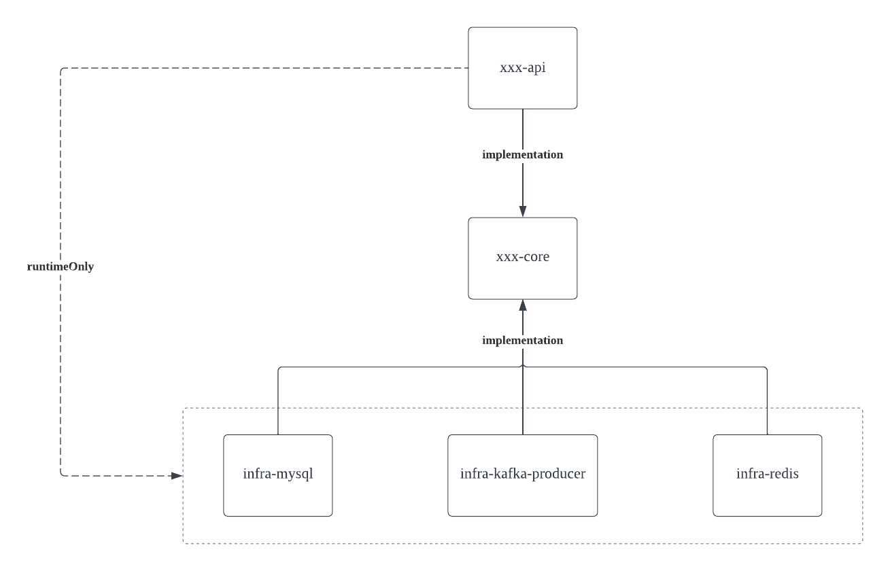
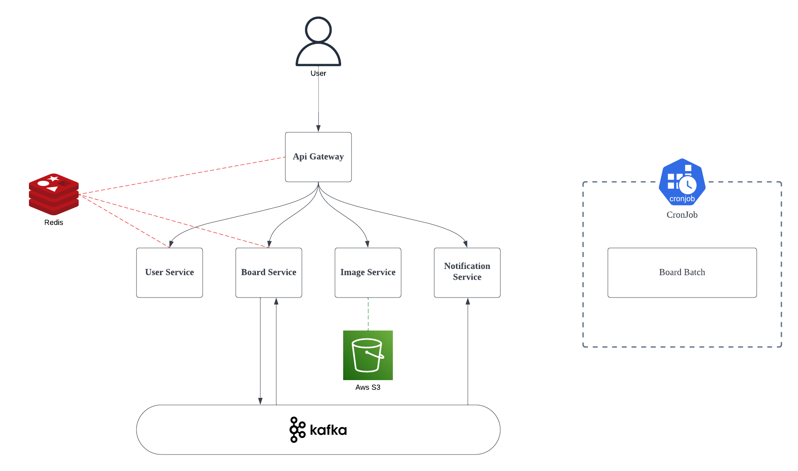
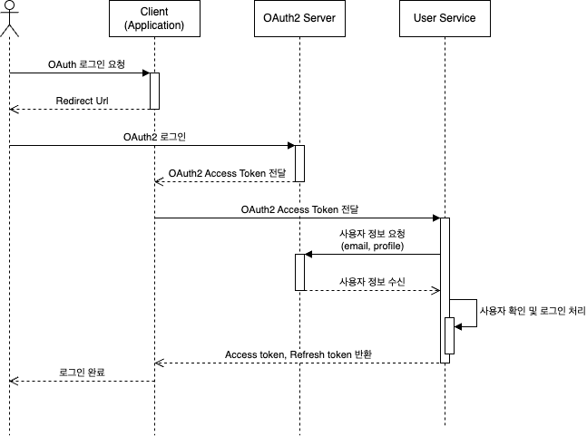
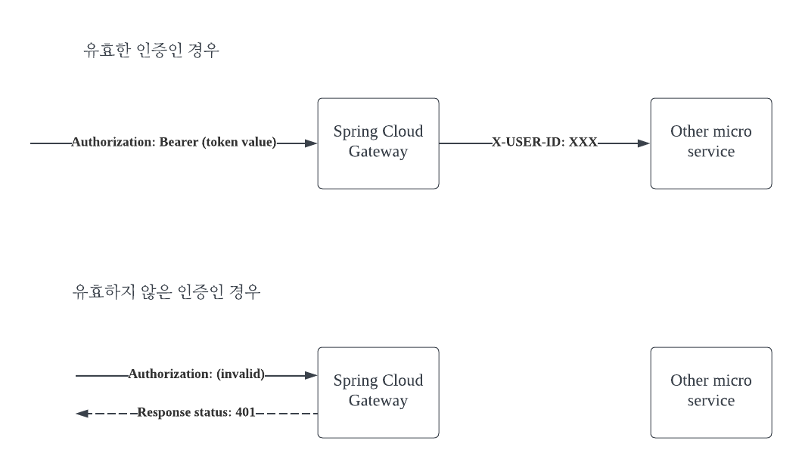
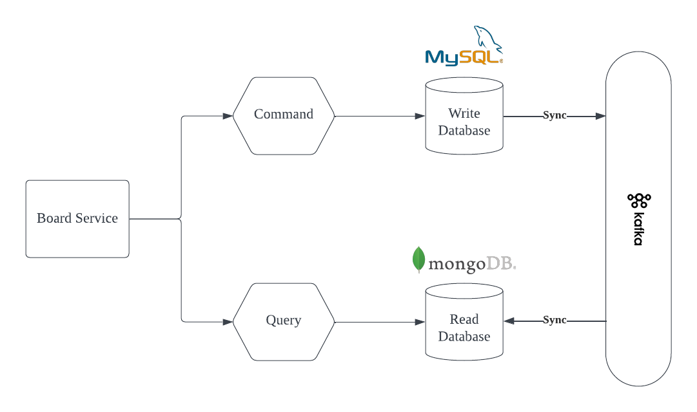
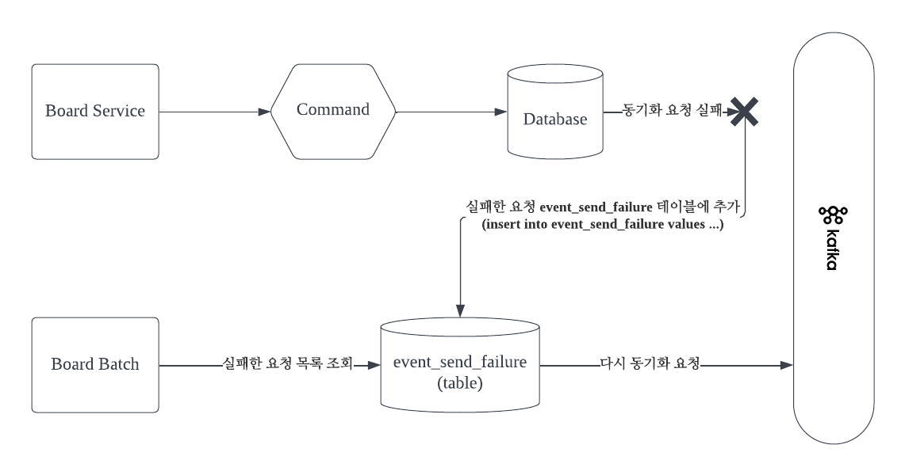
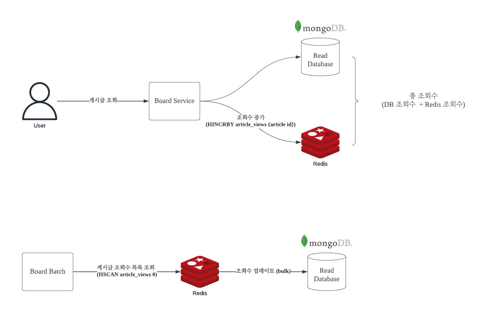
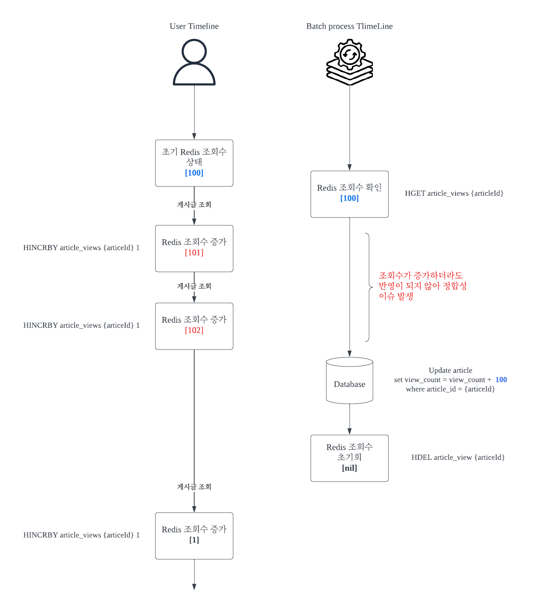
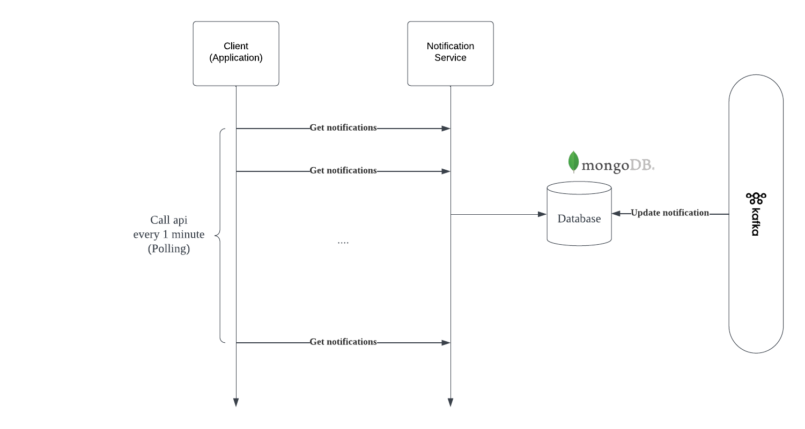
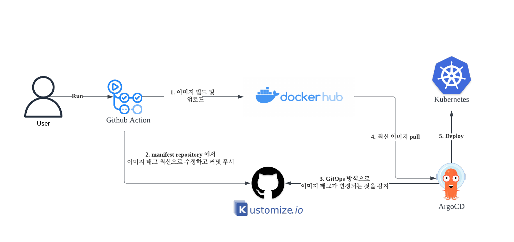

# simpleboard

## 프로젝트 소개

마이크로 서비스 기반의 게시판 프로젝트

## 개요
[overview.md](overview.md)

## API 문서

| 서비스                  | 문서                                                                       |
|----------------------|--------------------------------------------------------------------------|
| USER SERVICE         | [링크](https://yellowsunn.github.io/simpleboard/user-service.html)         |
| BOARD SERVICE        | [링크](https://yellowsunn.github.io/simpleboard/board-service.html)        |
| NOTIFICATION SERVICE | [링크](https://yellowsunn.github.io/simpleboard/notification-service.html) |
| IMAGE SERVICE        | [링크](https://yellowsunn.github.io/simpleboard/image-service.html)        |

## DB 설계

### 물리 모델


## 아키 텍쳐

| 기술스택           | 개발환경                                                                                |
|----------------|-------------------------------------------------------------------------------------|
| Spring Boot    | - Spring Framework 3.x<br/> - Java 17 or Kotlin<br/> - Gradle<br/> - Spring Web Mvc |
| Spring Cloud   | - Gateway                                                                           | 
| Authentication | - JWT (Json Web Token)<br/> - OAuth2                                                |
| Message Queue  | - Kafka                                                                             |
| Batch          | - Spring Batch                                                                      |                                                                     |
| Database       | - Mysql<br/> - MongoDB<br/> - Redis                                                 |
| Test           | - Spring RestDocs<br/> - JUnit5                                                     |
| Vue.js         | - v3.2.13                                                                           |

```
1. JWT 토큰을 이용한 로그인, 회원가입 구현
2. Kafka를 사용해 이벤트 드리븐 아키텍쳐 구현
3. 스프링 배치를 이용해 벌크 insert/update 작업 구성
4. RestDocs를 이용한 테스트 작성 및 API 문서 자동화
```

### 프로젝트 모듈 구성

#### Gradle 모듈 구성 형식

```
xxx-service
┗ apps
  ┗ xxx-api, xxx-batch, xxx-consumer 등
┗ library
  ┗ xxx-core, infra-yyy 
```

* apps: 어플리케이션 서버
    * xxx-api: API 서버
    * xxx-batch: 배치 서버
    * xxx-consumer: (카프카) 컨슈머 서버
* library: 라이브러리 모듈
    * xxx-core: 도메인, 공통 기능, 인터페이스 등
    * infra-yyy: xxx-core에 정의된 인터페이스를 구현한 모듈 (Mysql, Redis, Rest template 등)

#### 모듈 간 의존성 예시



인프라스트럭처 레이어의 구현체 모듈을 런타임 시 빌드하도록 설정하여, 구현체에 직접적인 참조를 방지

### 시스템 아키텍처



#### 유저 서비스 - 시퀀스 다이어그램 (로그인)



#### API 게이트웨이 - 인증



* API 게이트웨이에서 Authorization 헤더로 전달된 JWT 토큰을 파싱
* 유효한 토큰인 경우 X-USER-ID 헤더로 유저 id 전달
* 유효하지 않은 토큰인 경우 401 응답 코드 반환

#### 게시판 서비스 - CQRS



* Command, Query 데이터베이스 분리
* 카프카로 동기화

이슈) 카프카 프로듀서에 동기화 요청 메시지를 전송하는데 실패한 경우?


* 실패한 데이터를 event_send_failure 테이블에 저장 후 배치를 통해 다시 프로듀서에 전송 요청

#### 게시판 서비스 - 조회수 증가



* 게시글 조회 시 조회수를 증가하는데 데이터베이스에 바로 반영하는 것이 아닌 레디스에 우선 조회수 업데이트
* 배치 작업으로 특정 시간마다 조회 수 데이터베이스에 bulk 업데이트

이슈) 배치 작업 도중 조회수가 증가하면 데이터 정합성 이슈 발생


해결 방법 (Lua Script를 이용해 Redis 다중 명령을 원자적으로 실행)


#### 알림 서비스


* 알림 메시지 수신시 DB에 반영
* 폴링 방식으로 지속적으로 요청해 새로운 알림이 존재하는 지 확인

## CI/CD 배포 파이프라인



* [docker hub 이미지 목록](https://hub.docker.com/u/yellowsunn)
* [manifest repository](https://github.com/yellowsunn/argocd-manifest/tree/main/manifest/simpleforum)

