## 1. 화면 예시
### 1.1 로그인 화면

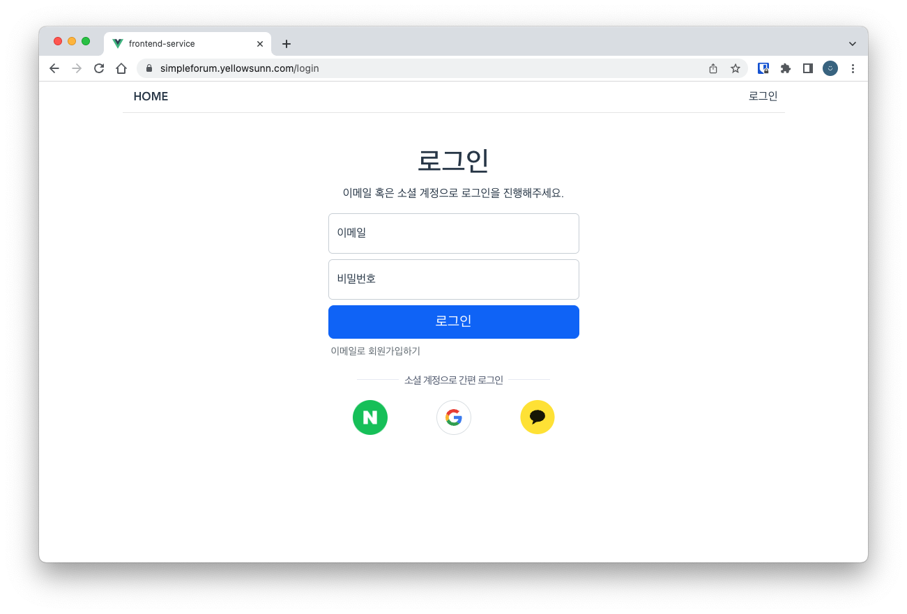

### 1.2 마이페이지 화면

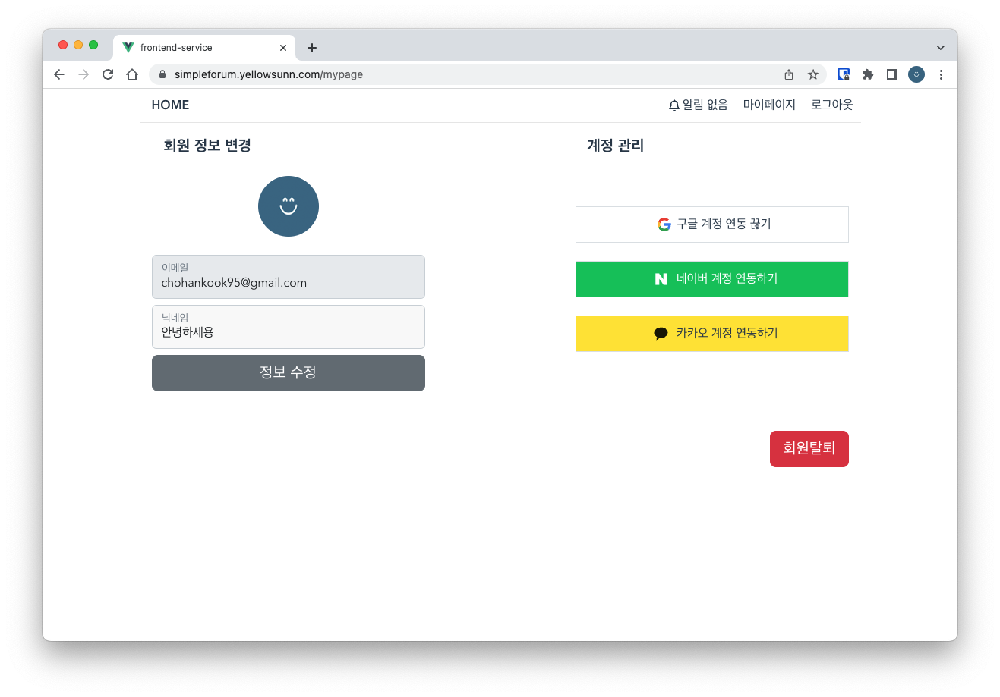

### 1.3 게시글 목록 화면
 
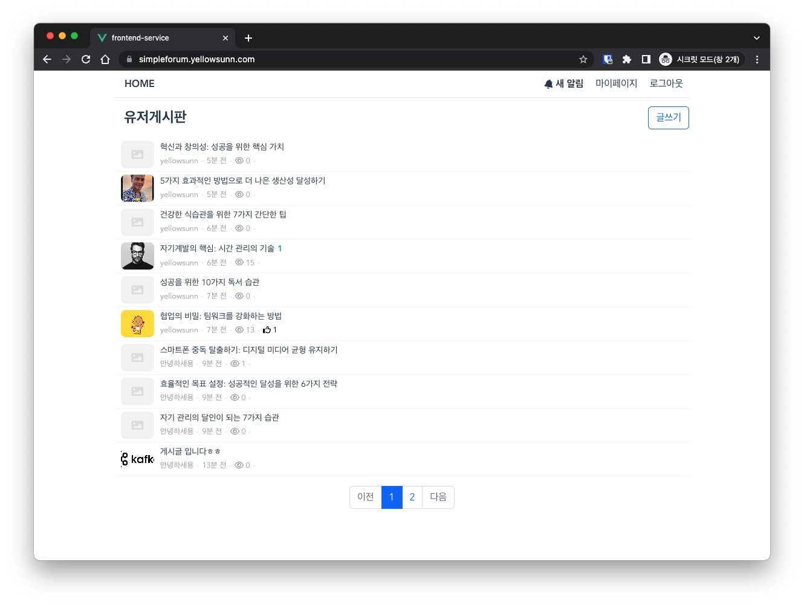

### 1.4 게시글 작성/수정 화면

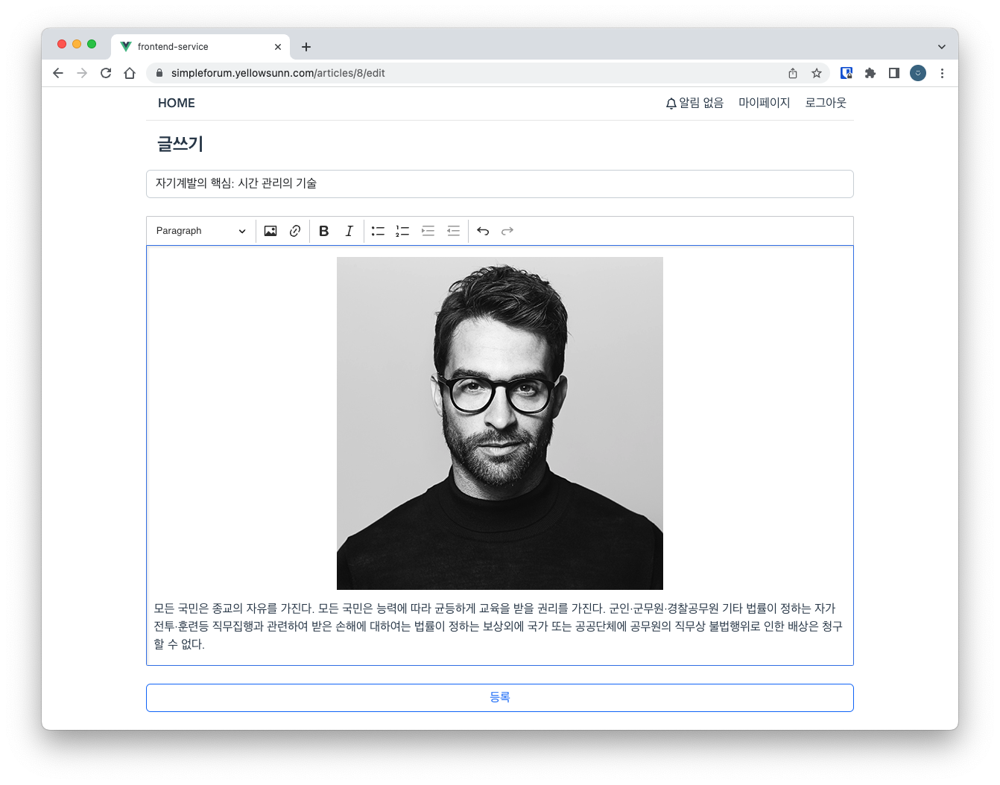

### 1.5 게시글 상세페이지 화면

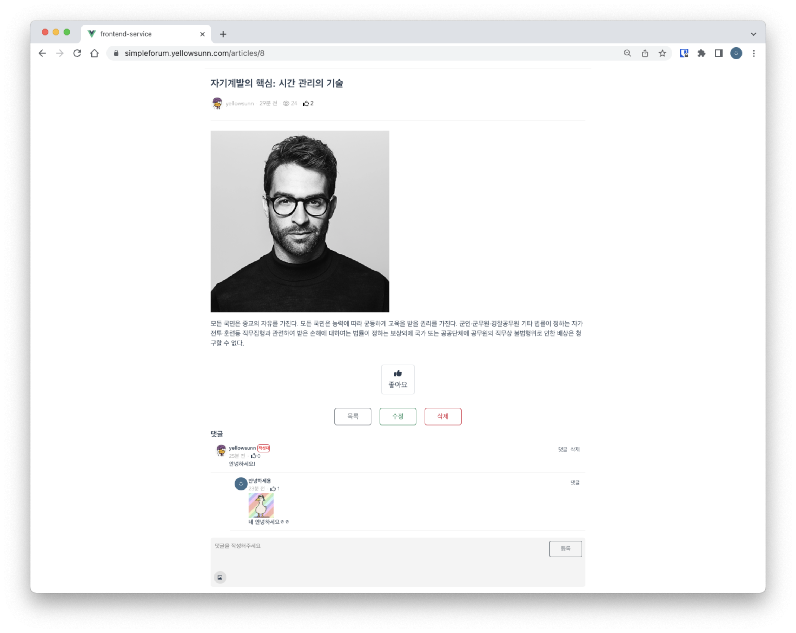

### 1.6 알림 화면
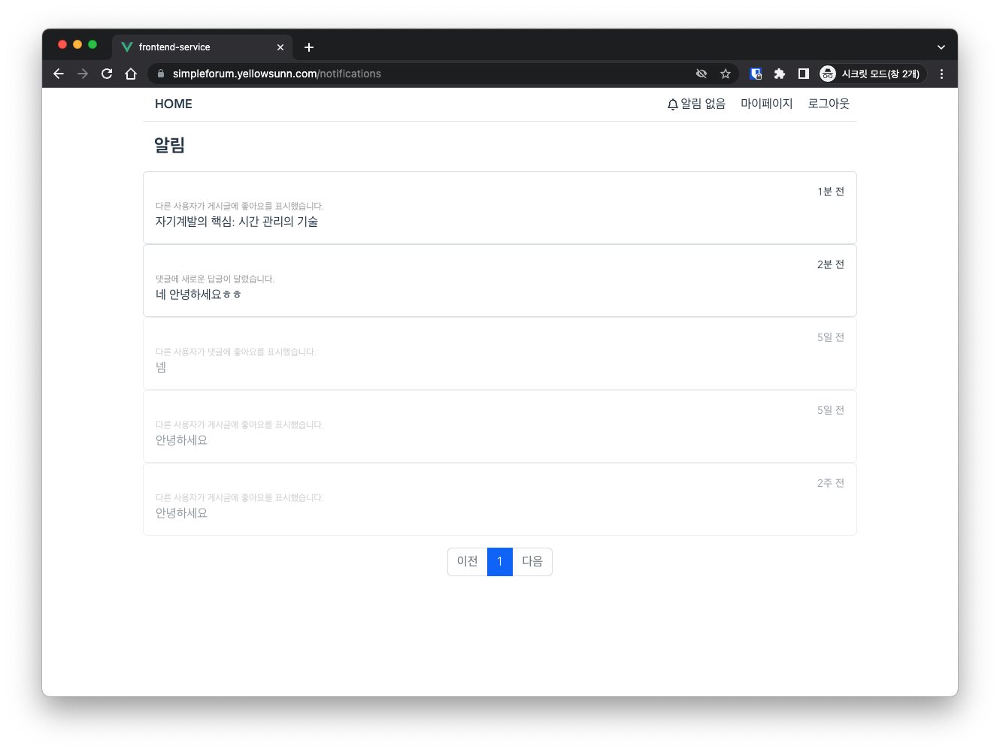

## 2. 배포 예시 (쿠버네티스)
### 2.1 Github Action(CI/CD) 으로 새로운 이미지 빌드 및 업로드
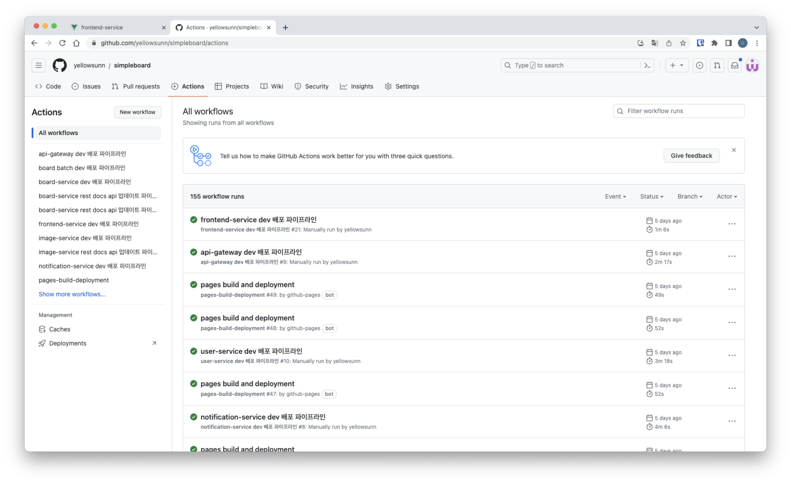

### 2.2 Docker hub에 이미지 자동 업로드
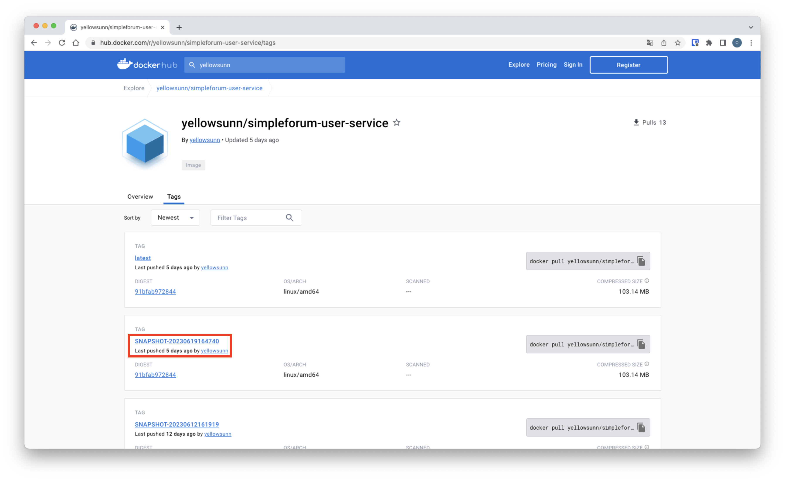

### 2.3 쿠버네티스에서 참조하는 이미지 태그 자동 수정 (github-action 봇에 의해 수정)
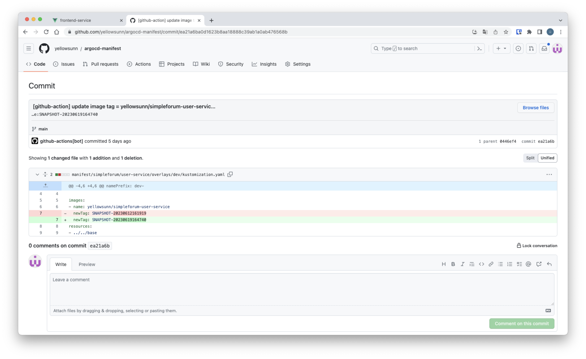

### 2.4 ArgoCD 에서 수정된 이미지로 배포

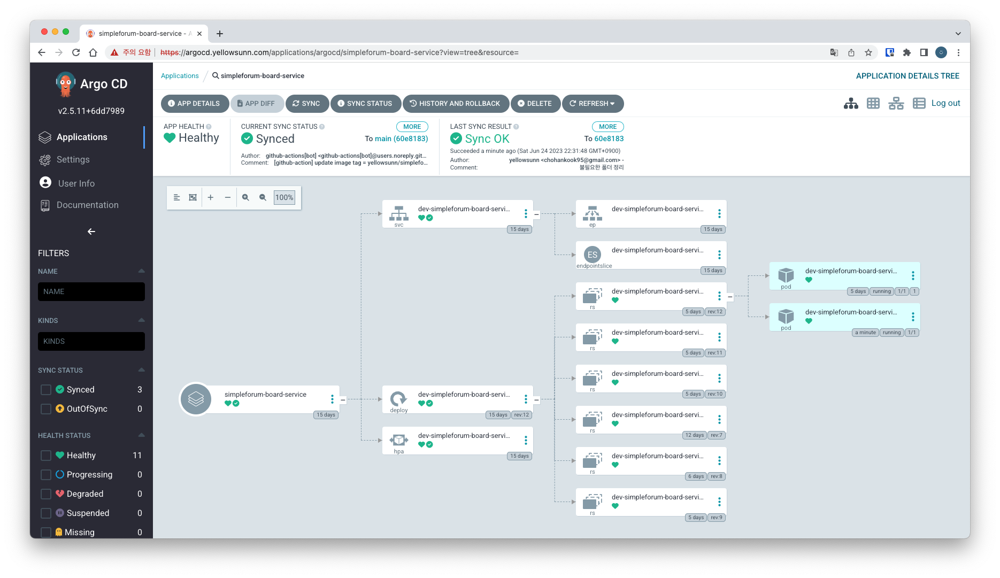

### 2.5 Cronjob 에 의한 배치 실행
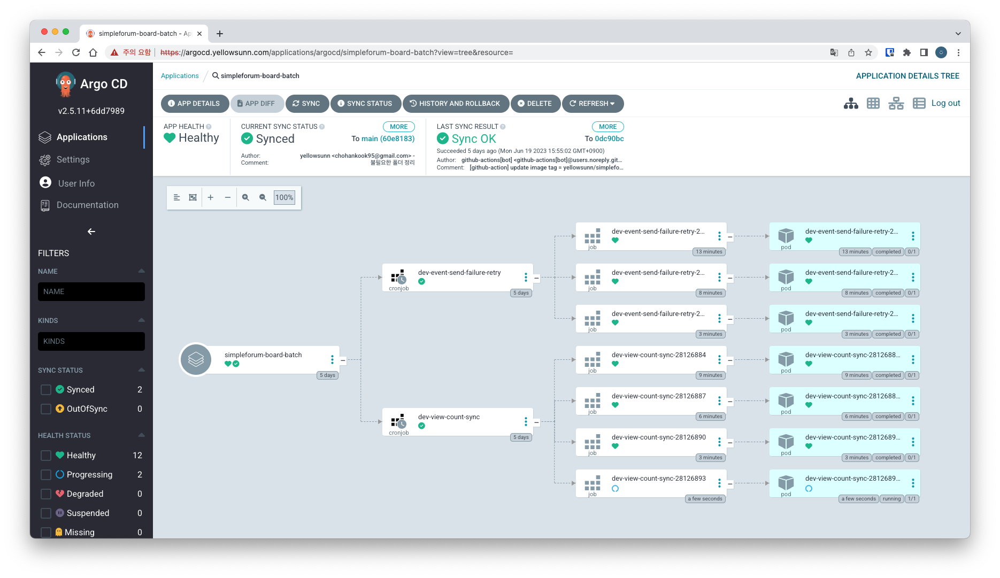
